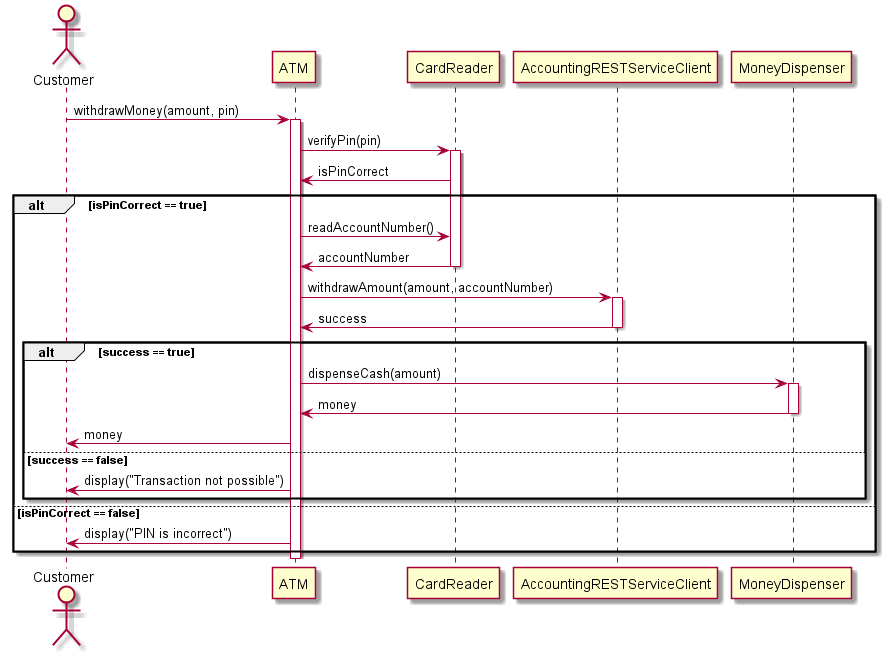

# "Hohe Testabdeckung durch gutes OO-Design"

Dieses Projekt enthält den Quellcode für einen Workshop, in dem gezeigt wird wie objektorientierter Java-Code
so designt werden kann, dass der Code gut (automatisiert) getestet werden kann. Als "Nebeneffekt" erhält man
ein gutes Code-Design, in dem die Klassen von ihren Abhängigkeit entkoppelt sind. Dies macht den Code besser 
verständlich und leichter wartbar.

## Vorausetzungen

* Git
* Java 8
* Eine IDE mit Funktion zur Messung der Testabdeckung, z.B.
  * __IntelliJ IDEA__ (Community oder Ultimate Edition) - oder
  * __Eclipse__ mit EclEmma und M2Eclipse Plugins
* Grundlegende Kenntnisse in 
  * objektorientierter Programmierung mit Java (Klasse, Interface, Objekt, Konstruktor)
  * JUnit
  * der `java.time` API
  * Mockito
 
## Verwendete Frameworks:
 
* [JUnit 4](https://junit.org/junit4/) - zum Implementieren und Ausführen von Unit-Tests.
* [Mockito](https://site.mockito.org/) - zum Ersetzen von Abhängigkeiten durch Testdoubles.
* [Apache Maven](https://maven.apache.org/) - Zur Verwaltung der Dependencies (Bibliotheken).

## Aufsetzen des Projekts

1. Klonen Sie dieses Projekt von GitHub.
1. Führen Sie im obersten Verzeichnis des Projekts auf einer Kommandozeile folgenden Befehl aus:

   ```$ mvnw clean install``` (Linux)

   ```$ mvnw.cmd clean install``` (Windows)

Der Build wird fehlschlagen, da die Unit-Tests noch nicht funktionsfähig sind. Ihre Aufgabe wird nun sein, die Testfälle 
"grün" zu machen ;-)

## Szenario 1: "Happy Hour"

### Ausgangssituation

Die Klasse `de.doubleslash.workshops.oodesign.happyhour.PriceService` liefert Preise für Cocktails -
und zwar unterschiedliche Preise, je nachdem ob gerade Happy Hour ist oder nicht, was wiederum von der aktuellen Uhrzeit abhängt. 

Zum Testen dieser Funktionalität wurde die Klasse `de.doubleslash.workshops.oodesign.happyhour.PriceServiceTest`
angelegt. Sie enthält Testmethoden zum Testen der Preise innerhalb sowie außerhalb der Happy Hour. Da immer nur eins
von beiden der Fall sein kann, werden immer zwei der vier Testmethoden fehlschlagen. 

#### Aufgabe 1: Testen des "PriceService"

Der `PriceService` muss von der Abhängigkeit "Zeit", also von der internen Nutzung von `LocalTime.now()` entkoppelt werden, 
damit das Testen des Service zu "unterschiedlichen Uhrzeiten" möglich wird.

1. Starten Sie den UnitTest `CocktailPriceServiceTest`. Sehen Sie wie zwei der vier Testmethoden fehlschlagen.

1. Fügen Sie dem Package `de.doubleslash.workshops.oodesign.happyhour` ein neues Interface namens `TimeProvider` hinzu, 
   mit der Methode `LocalTime getCurrentTime()`.

1. Schreiben Sie eine Klasse `CurrentTimeProvider`, die das Interface implementiert. Die Methode `getCurrentTime()` gibt
   `LocalDate.now()` zurück.

1. Fügen Sie dem Konstruktor der Klasse `CocktailPriceService` einen Parameter vom Interface-Typ `TimeProvider`
   hinzu. Speichern Sie das Argument als Klassenattribut namens `timeProvider`.

1. Ersetzen Sie den Ausdruck `LocalTime.now()` in der Klasse `CocktailPriceService` durch `timeProvider.getCurrentTime()`.

1. Die `Main`-Klasse im Package `happyhour` kompiliert jetzt nicht mehr, da der Konstruktor von `CocktailPriceService` nun 
   einen Parameter vom Typ `TimeProvider` erwartet. Übergeben Sie im Konstruktor eine Instanz der Klasse `CurrentTimeProvider`. 

1. Die Testklasse `CocktailPriceServiceTest` kompiliert auch nicht mehr, ebenfalls wegen des geänderten Konstruktors.
   Hier soll allerdings nicht der `CurrentTimeProvider` verwendet werden, da wir in den Tests kontrollieren möchten, welche
   Zeit vom `TimeProvider` zurückgegeben wird. 
   
   Schreiben Sie eine weitere Implementierung von `TimeProvider` eigens für den Unit-Test, und nennen Sie 
   sie `TestTimeProvider`. Die Klasse bekommt einen Konstruktor mit einem `LocalTime`-Parameter. Die dort übergebene Instanz
   wird von der `getCurrentTime()`-Methode zurückgegeben.

1. In der Methode `priceServiceAtTime` von `CocktailPriceServiceTest` übergeben Sie dem Konstruktor von `CocktailPriceService`
   nun ein `LocalTime`-Objekt mit der Uhrzeit aus den Methodenargumenten (`hour` und `minute`).
   
   => Der `CocktailPriceServiceTest` sollte jetzt erfolgreich durchlaufen. 

## Szenario 2: "Geldautomat"

Die Klasse `de.doubleslash.workshops.oodesign.atm.ATM` (Automatic Teller Machine) repräsentiert 
einen **Geldautomaten**, mit dem Kunden einer Bank sich Geld auszahlen lassen können. 

Die Klasse `ATM` hat die folgenden **Abhängigkeiten**:

* **`CardReader`**: repräsentiert eine Hardwarekomponente, die die vom Benutzer eingegebene PIN verifiziert 
    und die Kontonummer ausliest
* **`AccountingRESTServiceClient`**: ruft einen REST-Service auf, über den die Abhebung auf dem Konto des Kunden verbucht wird
* **`MoneyDispenser`**: repräsentiert die Hardwarekomponente, die das Bargeld enthält und ausgibt.

Folgender Prozess ist in `ATM` implementiert:


### Ausgangssituation

Offensichtlich wurde die Klasse `ATM` nicht testgetrieben entwickelt. Denn sie ist so gestaltet, 
dass sie ihre Abhängigkeiten selbst in ihrem Konstruktor erzeugt. Das macht die Klasse untestbar, denn
es ist nicht möglich, ihre Abhängigkeiten durch Testdoubles auszutauschen (diesen Vorgang nennt man
"mocken"; hierfür wird üblicherweise ein Mocking-Framework wie [Mockito](https://site.mockito.org/) verwendet).

Darüber hinaus ist die Klasse `de.doubleslash.workshops.oodesign.atm.AccountingRESTServiceClient` als 
Singleton implementiert. Dadurch kann in der laufenden Anwendung nur eine einzige Instanz existieren,
was das Testen zusätzlich erschwert.  

### Aufgabe 2.1: Audit-Log des Konto-Service testen

Die Klasse `AccountingRESTServiceClient` loggt alle Verbuchungen der Geldabhebungen. 
Da die Bank Audit-Verpflichtungen hat, soll ein Test sicherstellen, dass der Logaufruf tatsächlich passiert. 
Dafür wurde das Testgerüst `de.doubleslash.workshops.oodesign.atm.AccountingRESTServiceClientTest` angelegt.
Das Problem hierbei ist, dass die Logmethoden der Klasse `AuditLog` `static` sind 
und nicht ohne weiteres gemockt werden können.

1. Zunächst sorgen Sie dafür, dass die Klasse `de.doubleslash.workshops.oodesign.atm.AccountingRESTServiceClient` 
   kein Singleton mehr ist. Entfernen Sie dazu die Methode `getInstance()` sowie die statische Klassenvariable 
   `instance`, und machen Sie den Konstruktor `public`.

1. Ändern Sie die Log-Methoden `info`, `warn` und `error` der Klasse `de.doubleslash.workshops.oodesign.atm.log.AuditLog` 
   so dass diese nicht mehr `static` sind.

1. Fügen Sie dem Konstruktor von `AccountingRESTServiceClient` einen Parameter vom Typ `AuditLog` hinzu, und speichern Sie das 
   übergebene Argument als Instanzvariable mit Namen `log`.

1. Ersetzen Sie alle statischen Log-Aufrufe in der Klasse durch Aufrufe auf die neue `log`-Variable.

1. Die Klasse `ATM` kompiliert nun nicht mehr. Ändern Sie die Initailisierung der Variable `accountingService`, indem Sie 
   die Klasse `AccountingRESTServiceClient` über ihren Konstruktor initialisieren, dem Sie eine neue Instanz von `AuditLog` 
   mitgeben.

1. Tun Sie dasselbe in `AccountingRESTServiceClientTest` bei der Initialisierung von `testee`, damit auch die Testklasse 
   wieder kompiliert.

1. Nun soll die Klasse `AccountingRESTServiceClient` von ihrer Abhängigkeit zu `AuditLog` entkoppelt werden. Erstellen Sie 
   dazu ein neues Interface namens `Log` mit den Methoden `info`, `warn` und `error` wie sie in `AuditLog` definiert sind, 
   und lassen Sie `AuditLog` das Interface implementieren.
   Hierfür können Sie das "Extract Interface"-Refactoring Ihrer IDE nutzen. Die Enum `LogLevel` wandert von `AuditLog` 
   in das `Log`-Interface.

1. Ersetzen Sie im `AccountingRESTServiceClient` alle Stellen wo `AuditLog` verwendet wird durch das Interface `Log`. 
   Jetzt ist der `AccountingRESTServiceClient` nicht mehr abhängig von der konkreten `AuditLog`-Implementierung.

1. Um das Logging des `AccountingRESTServiceClient` testen zu können, erstellen Sie nun eine weitere Implementierung des
   `Log`-Interfaces namens `TestLog`, die ausschließlich fürs Testen gedacht ist. Daher landet die Klasse unterhalb von 
   `src\test\java\...`, d.h. im selben Verzeichnis wie die `AccountingRESTServiceClientTest`-Klasse.

1. Implementieren Sie die `info`-Methode der `TestLog`-Klasse so, dass sie alle geloggten Nachrichten in einer `List` 
   speichert.
   
   _Tipp:_ nutzen Sie hierfür die Methode `String#format(...)`, wie sie auch in `AuditLog` verwendet wird. 

1. Fügen Sie `TestLog` eine Methode `getLogMessages()` hinzu, die die Liste zurückgibt.

1. Im `AccountingRESTServiceClientTest` verwenden Sie nun statt `AuditLog` eine `TestLog`-Instanz. Diese muss als 
   Klassenattribut gespeichert werden, damit die Testmethode darauf zugreifen kann.

1. Jetzt können Sie die Testmethode `accountingServiceShouldLogTransaction()` fertig implementieren, indem Sie 
   die Liste der geloggten Nachrichten von `TestLog` abfragen und in der lokalen Variablen `loggedMessages` speichern.
   
   => Der `AccountingRESTServiceClientTest` sollte nun erfolgreich durchlaufen.

### Aufgabe 2.2: Funktionalität der Klasse ATM testen 

Für die Geldautomat-Funktionalität in `ATM` sollen nachträglich Unit-Tests geschrieben werden.

Verschiedene Szenarien sollen getestet werden, z.B. dass keine Auszahlung erfolgt, wenn die PIN falsch 
eingegeben wurde bzw. die Abhebung nicht verbucht werden konnte.

Dafür existiert bereits die UnitTest-Klasse `de.doubleslash.workshops.oodesign.atm.ATMTest` mit
entsprechenden Testmethoden, die noch ausimplementiert werden müssen. Damit die Klasse `ATM`
getestet werden kann, muss sie zunächst einem Refactoring unterzogen werden. Danach können die Testmethoden fertiggestellt werden.

1. Schauen Sie sich die Klasse `ATMTest` und die darin definierten Testfälle an. 

1. Der Konstruktor von `ATM` erzeugt seine Abhängigkeiten selbst (`CardReader`, `AccountingRESTServiceClient` und `MoneyDispenser`).
   Ändern Sie dies, indem Sie den Konstruktor von `ATM` so erweitern, dass er Objekte dieser drei Klassen als Parameter entgegen nimmt.
   Speichern Sie die Argumente aus dem Konstruktor anstelle der mit `new` erzeugten Instanzen in den Klassenvariablen.
1. Die Methode `Main` kompiliert nicht mehr. Korrigieren Sie dies, indem Sie die erwarteten Konstruktor-Parameter bei der Instanzierung von `ATM` hinzufügen (`new CardReader()` etc.).

1. Die Testklasse `ATMTest` kompiliert ebenfalls nicht mehr. Bei der Instanzierung von `testee` (d.h. "Testkandidat") verwenden Sie 
   jedoch keine echten Instanzen der abhängigken Klassen, sondern sogenannte Mock-Objekte. Hierzu verwenden Sie das Mocking-Framework
   [Mockito](https://site.mockito.org/).
   
   Ein Mock-Objekt für die Klasse `CardReader` wird beispielsweise folgendermaßen erzeugt:
   `CardReader cardReaderMock = Mockito.mock(CardReader.class);` 
   
   Die Mock-Objekte müssen als Instanzvariablen der Testklasse definiert werden, damit die Testmethoden darauf zugreifen können.

1. Jetzt können die Testmethoden in `ATMTest` fertig implementiert werden. Beginnen Sie mit der ersten Methode
   `accountingServiceShouldBeCalledWithCorrect...`.

   Standardmäßig geben Mock-Objekte `0`, `false` oder `null` zurück wenn eine ihrer Methoden aufgerufen wird. Mit 
   `Mockito.when(...).thenReturn(...);` kann man dafür sorgen, dass ein Mock für einen bestimmten Methodenaufruf einen
   definierten Wert zurückgibt. Der `CardReader`-Mock soll z.B. die Kontonummer _4711_ zurückliefern, wenn seine 
   `radAccountNumber()`-Methode aufgerufen wird. 
   Dies erreichen Sie mit `Mockito.when(cardReaderMock.readAccountNumber()).thenReturn(4711);`.
   Weiterhin müssen Sie dafür sorgen, dass die `verifyPin()`-Methode von CardReader `true` zurückgibt. Tun Sie das analog
   mit `Mockito.when(...).thenReturn(...)`.
   
   Nach dem Aufruf der zu testenden Methode `testee.withdrawMoney(1234, 100.0)` soll geprüft werden, ob `ATM`
   die Methode `withdrawAmount(...)` von `AccountingRestServiceClient` aufgerufen hat, und zwar mit den korrekten Werten -
   also dem Betrag aus `testee.withdrawMoney(...)` sowie der Kontonummer, die von `cardReaderMock` geliefert wurde.
   
   Hierfür gibt es `Mockito.verify(...)`. 
   Ersetzen Sie das `fail(...)`-Statement am Ende der Testmethode durch: `Mockito.verify(accountingServiceMock).withdrawAmount(100.0, 4711);`.
   
   => Wenn Sie alles richtig gemacht haben, sollte diese Testmethode jetzt erfolgreich durchlaufen.

1. Implementieren Sie die restlichen Testmethoden nach dem gleichen Schema, bis die ganze Testklasse "grün" ist.
   
__Mockito-Tipps:__ 
* Es ist auch möglich zu verifizieren, dass eine bestimmte Methode (z.B. `xyz(...)`) auf einem Mock (z.B. `myMock`) _nicht_ aufgerufen wurde:
`Mockito.verify(myMock, Mockito.never()).xyz(...);`
* Wenn bei Methodenaufrufen auf Mock-Objekte der Wert der Argumente egal ist, können Sie statt konkreten Werten
 auch `Mockito.anyInt()`, `Mockito.anyDouble()` etc. übergeben.
* Es ist auch möglich, einen Mock beim Aufruf einer bestimmten Methode eine Exception werfen zu lassen, z.B.:
 `Mockito.when(myMock.methodCall()).thenThrow(new SomeException());`
* Sollte etwas mit den Mockito-Methoden nicht wie erwartet funktionieren, versichern Sie sich bitte ob die Klammern korrekt gesetzt sind.
* Das JavaDoc von Mockito gibt Auskunft über die Verwendung der Methoden des Frameworks. 
  
  _(Unabhängig von Mockito: ein Blick ins JavaDoc lohnt sich immer! ;-)_
  
